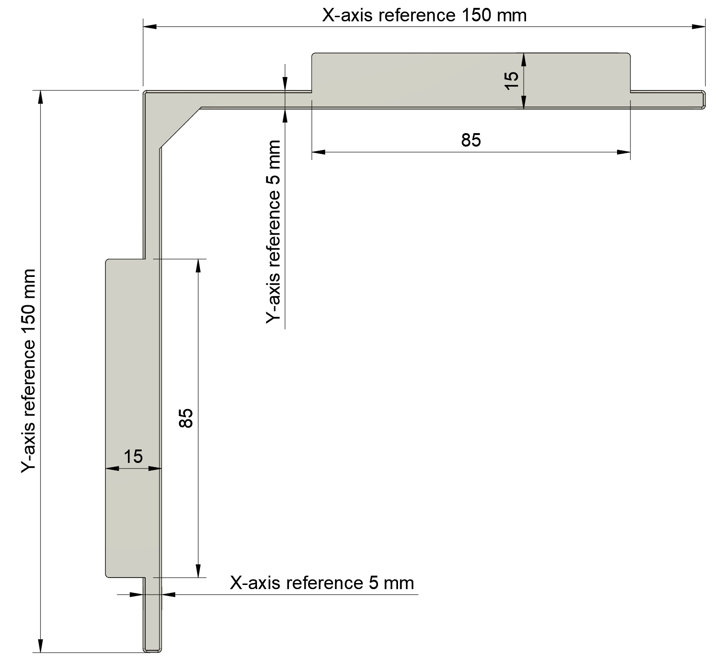
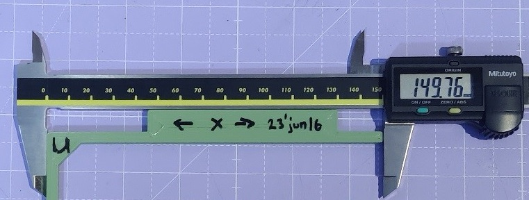

# (Work in Progress) Material Shrinkage and Extrusion Multiplier Tuning

## Why is This Calibration Necessary?
After correcting for the mechanical accuracy of the tool head movement in [XY Differential Calibration](xy-differential-calibration.md), in order to achieve accurate parts, additional factors must be accounted for. Among those are the extrusion multiplier and compensating for the shrinkage of the material as it cools down, having been thermally expanded during extrusion.

## How is This Different from Other Calibration Procedures?
This procedure uses a differential measurement, similar to that in [XY Differential Calibration](xy-differential-calibration.md), to compute the material shrinkage factor without the influence of the extrusion width. I.e. any error in the `rotation_distance` for the extruder, and any error in the (not yet calibrated) extrusion multiplier in the slicer will not affect the calculation of the material shrinkage factor. This results in a more accurate computed value for the shrinkage. For more information see the [paper](shrinkage-and-multiplier-calibration.pdf).

The extrusion multiplier is then computed while compensating for the just computed material shrinkage to arrive at an extrusion multiplier that is more correct and will result in more dimensionally accurate parts.

## Before We Start

### Prerequisites
* You have a copy of the [calibration spreadsheet](https://docs.google.com/spreadsheets/d/12_Dv7_rYfVe8zgUhWrPeNcvSJCttsugQXTOSlCp6MAc).
   * Familiarize yourself with the "Material Calibration" tab before starting.
   * This is a good place to store your calibration results long term.
* You have competed [XY Differential Calibration](xy-differential-calibration.md).
* You have completed [Extruder Rotation Distance Calibration](https://ellis3dp.com/Print-Tuning-Guide/articles/extruder_calibration.html).
   * Make sure you're happy with your calibration. Redoing the E-steps calibration invalidates all extrusion multiplier calibrations for your filaments.
* You have [calibrated pressure advance](https://ellis3dp.com/Print-Tuning-Guide/articles/pressure_linear_advance/introduction.html) for the filament you will be calibrating.
   * The pressure advance must err on the side of too-high so corners don't bulge on the calibration prints.
   * Test and adjust temporarily before calibrating.
* You need a pair of 150 mm digital calipers.
* You need a micrometer for calibrating the extrusion multiplier.
   * The micrometer is necessary for this extrusion multiplier calibration. Attempts to use normal calipers will introduce an error of around ±5% in the extrusion multiplier making it useless. Only if you have a calibration certificate for your calipers and they say 0.00 mm accuracy on parts below 1 mm in size, then can you use them, expect an error of ±1% when using an extrusion width of 0.5 mm, even then the results are barely useful.
   * The error contribution to the extrusion multiplier will be ±0.1% from a micrometer of accuracy of 0µm (i.e. 500nm, check your cal. cert) on an extrusion width of 0.5 mm.
   * If you do not have access to a micrometer, use another method for calibrating extrusion multiplier like [Ellis' Extrusion Multiplier](https://ellis3dp.com/Print-Tuning-Guide/articles/extrusion_multiplier.html). Note that using a method like Ellis' that prioritizes aesthetics may impact the dimensional accuracy of the part slightly.

### When Should You Re-Do the Calibration?
For every filament profile you print with when:
* First creating the profile
* After changing extruder `rotation_distance`.
* After changing the nozzle temperature of the profile (the shrinkage is a factor of the material temperature over ambient).

### What to Expect in Terms of Results
TBD

## Calibration Procedure 

### Material Shrinkage
*This must be done prior to attempting to calibrate the extrusion multiplier.*

1. Create a new row for your filament in the calibration spreadsheet and enter name, manufacturer, colour and current extrusion multiplier.
1. Print the [XY Reference Dimensions.stl](stl/XY%20Reference%20Dimensions.stl) model.
    * Use enough perimeters to make the thin beams solid.
    * Use a layer height of 0.1 mm. 
    * Print external perimeters first.
    * Lower the extrusion multiplier by 5% to make sure the model isn't over extruded in the interior which could cause the reference dimensions to bulge and affect the accuracy of the measurement.
    * Let the model cool slowly to room temperature.
    * Make sure it is free from warping, re-print if necessary.
    * Print slowly for maximum accuracy, 60 mm/s is good a safe default.
1. Let cool slowly to room temperature.
1. Before taking it off the build place, mark the X and Y axis directions on the part.
1. Measure the 150 mm and 5 mm reference dimensions as indicated in  and enter into the spreadsheet. 
    * Pay close attention to which dimension is which, the small dimensions are swapped and easily confused.
    * Make use of the "tabs" on the model to align your calipers as in the image below for repeatable and accurate measurements. 
1. Use the X and Y scale factors calculated by the spreadsheet to scale the model in the slicer. Re-slice, re-print and verify the calibration.
1. If your slicer supports per-material scale factors enter them there, otherwise upvote [PrusaSlicer issue#4475](https://github.com/prusa3d/PrusaSlicer/issues/4475) and keep the calibration spreadsheet handy every time you print.

If the calibration is stable, proceed with calibrating the extrusion multiplier below. 

If the X and Y scale factors are notably different, something has gone wrong. Review the procedure and try again.

### Extrusion Multiplier
*This calibration relies on knowing the material shrinkage factor computed above, perform the above calibration first.

1. Enter your current extrusion multiplier for the material in the calibration spreadsheet.
1. Slice and print the [Extrusion Multiplier.stl](stl/Extrusion%20Multiplier.stl) calibration object.
    * Increase your pressure advance slightly, the corners must absolutely not bulge.
    * Use a wide extrusion for best accuracy (150% nozzle size is good).
    * Use thin layers, 0.01 mm.
    * Use **vase mode**.
    * Print slowly for maximum accuracy, 60 mm/s is good a safe default.
    * Use a generous brim and be prepared to let it cool slowly to room temperature.
        * Any warping in the part will ruin the calibration.
1. Let cool slowly to room temperature.
1. Inspect part for any warping or over extrusion around the corners.
    * Adjust and re-print if necessary.
1. Measure twice per side of the cube above the notches on the bottom, note down the reading in the calibration spreadsheet.
    * As indicated here: .
1. Copy the new extrusion multiplier into your material profile.
1. Reprint to verify.