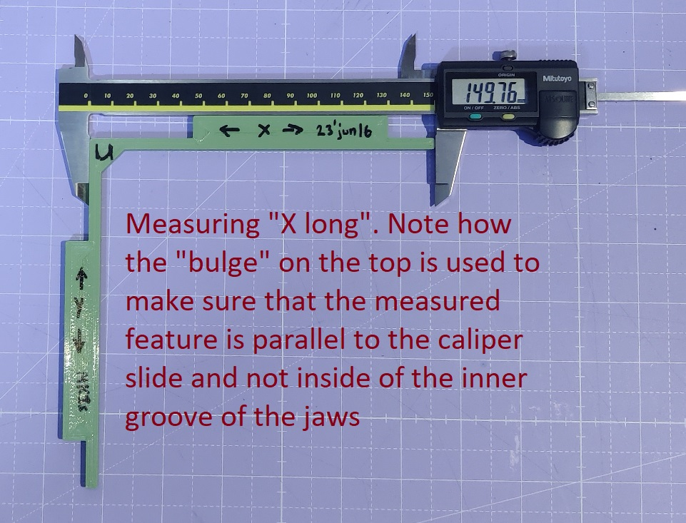
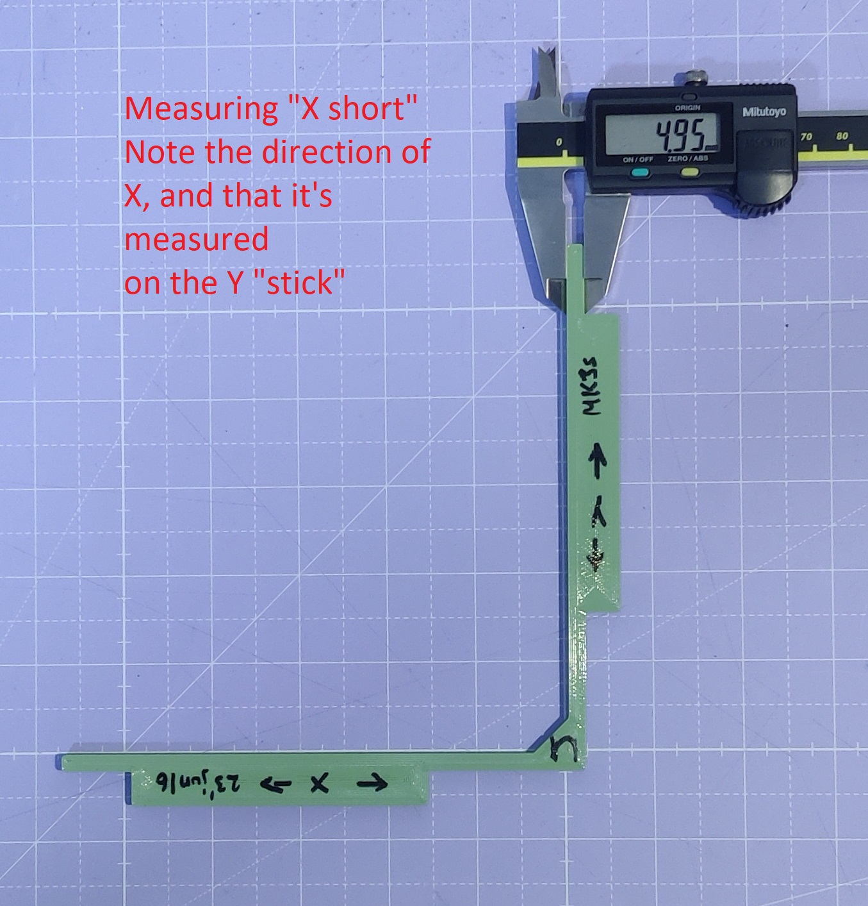

# Extrusion and shrinkage independent XY Calibration

For this calibration procedure you will need the following:
* Digital vernier calipers, at least 150mm long.
* Two filaments with notably different shrinkage, like for example PETG and ABS/PC Blend/PLA.
* A printer to calibrate :)

## Preparation

* Make sure you have done apply skew correction for your printer.
* Make sure you have at least a decent calibration for pressure advance for both materials used.
* Slice the [test print](stl/xy-calibration-model.stl) twice, onece for each material and **make sure** that `External Perimeters` first is enabled in your slicer. Failure to enable External Parameters first can result in an improper calibration. Use 3 perimeters and some small amount of rectilinear infill. The part must be stiff so that it doesn't deflect or compress during measuring.
* Reset the `rotation_distance` of the printer to the calculated value (`40` for Voron Trident/2.4).
* We will call the two different materials A and B. For each of A and B, pick a material with different shrinkage, and make a note of which is A and which is B. This is critical.

## Print the Test Part 3 Times
1. Print the test part with material A, use a sharpie or similar to mark the direction of the X and Y axis, and call this part "U" which material was used and what `rotation_distance` (default).
1. Same as above but print the file with material B, label it as "V"
1. Increase the `rotation_distance` for both X and Y by 3% in your printer config (e.g. 41.2 if it was 40 initially), and print the test part again with material A. And label it as the one with a different `rotation_distance`, label it as "W".

## Measure the Parts
Each test part has four dimensions that need to be measured. The long X axis feature (nominally 150mm), the short X-axis feature (nominally 5mm), the long Y axis feature (nominally 150mm) and the short Y axis feature (nominally 5mm).

Measure all four features for each of U, V, and W as shown in the picutres above, and make a table like the below for yourself:

Feature|U|V|W
-|-|-|-
X long| 149.10 mm | 149.40 mm | 149.00 mm 
X shor| 4.98 mm | 4.92 mm | 4.91 mm
Y long| 149.11 mm | 149.40 mm | 149.10 mm 
Y short| 4.96  mm| 4.92 mm | 4.93 mm

## Compute the scale error and material shrinkage
Use your table of measurements and the [spreadsheet (TBD)]() to compute the XY error and material shrinkage.
