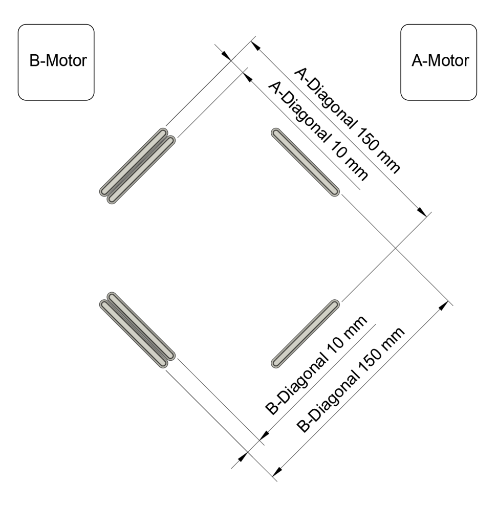

# XY Differential Calibration
This calibration procedure is intended for CoreXY FDM printers running Klipper firmware. However it can easily be adapted for Cartesian printers and other firmware. If you wish to do that, I recommend reading the [paper](differential-ab-calibration.pdf) first in order to understand the nuances of the procedure.

## Why is This Calibration Necessary?
While it's commonly assumed that the `rotation_distance` for A- and B-motors on CoreXY printers can be precisely determined using belt pitch and pulley tooth count, this overlooks the influence of belt tension and manufacturing variances. These factors necessitate a calibration of the `rotation_distance` for both the A and B motors. For a detailed rationale, please see section 8, Appendix, of [differential-ab-calibration.pdf](differential-ab-calibration.pdf).

*"Scaling in the slicer is enough, isn't it?"* - Relying solely on slicer scaling overlooks critical inaccuracies. An incorrect `rotation_distance` affects not just the final dimensions pre-shrinkage but also alters the toolhead's movement dynamics. This discrepancy leads to uneven material deposition and can vary between the directions controlled by the A- and B-motors. Moreover, it disrupts perimeter spacing, amplifying over- or under-extrusion issues. Slicer scaling cannot address these fundamental errors, nor can adjusting the extrusion multiplier, which merely shifts the problem to other print aspects (e.g., walls, support structures, infill, or bridges).

Addressing the root cause through calibration ensures a more accurate and reliable printing process.

## How is This Different from Other Calibration Procedures?
Calibration practices generally divide into two main strategies:
1. Directly measuring the toolhead motion with instruments such as dial gauges, as demonstrated by [Teaching Tech](https://teachingtechyt.github.io/calibration.html#xyzsteps). The accuracy of such methods is hampered by the inherently short travel range of the gauge. This limitation means even minor measurement errors can disproportionately affect the outcome.
2. Measuring printed parts against their intended dimensions, for example [Calibration Bro](https://www.printables.com/model/164261-calibration-bro-calibration-shape-calculator-klipp), [Califlower](https://vector3d.co.uk/product/califlower/) by V3D, and the [illfated calibration cube](https://www.youtube.com/watch?v=H7OsnMLDIMw&t=699s&pp=ygUMY25jIGtpdGNoZW4g). These methods commonly produce inaccurate calibration due to the presence of material shrinkage and/or incorrect extrusion width.

Our method falls in the second category but uses differential measurements to mitigate the impact of material shrinkage and extrusion width to overcome the drawbacks of other methods. For more details, please see the [paper](differential-ab-calibration.pdf).

## Before We Start
This calibration process demands precision and strict adherence to instructions to counter various error sources. Inaccuracies or deviations will degrade your calibration result. For each measurement requested, measure 5 times and take the median.

Expect to spend an evening or afternoon for this procedure.

### When to Recalibrate
Recalibrate if there are changes to belt tension or printer frame geometry.

### Example Results
My calibration significantly reduced scale error and skew, enhancing dimensional accuracy and eliminating the need for skew correction. For instance, scale error improved from (0.221%, -0.157%) to (0.007%, 0.007%) for B- and A-diagonals respectively. Skew also improved to the point where correction is no longer necessary.

Confidence in these results comes from mathematical analysis, multiple measurements which were consistent and multiple rounds of calibration that converged to the above within measurement error.

### Requirements
- **Digital Calipers**: 150mm, 0.01mm precision. Mitutoyo is highly recommended.
- **Filament**: High quality, consistent diameter (±0.02mm or better ideally). Prusament PETG is suggested.

### Measuring Tips
When measuring, make sure that:

* Both jaws are making parallel contact with the measuring surfaces by applying light pressure on the mid point of the jaws. Due to skew, the jaws might not make full contact on the measuring surfaces, this is OK. Subsequent rounds will remove large parts of the skew gradually improving the contact and measurement.
* Both jaws are making contact on the same height of the printed part, just below the top layer.
* You're not pressing so hard that the part deflects. If you back off on the pressure and the measured value increases slightly, that means that you're pressing too hard as the material flexes back once you release the pressure, or not holding the calipers steady.
* Measure each distance 5 times, removing the calipers each time, discard any outliers and re-measure them. If you get the same value to within 0.02 mm each time, you're doing well. Use the [median](https://en.wikipedia.org/wiki/Median) of the 5 measurements as the value you enter into the spreadsheet.

The below pictures show me measuring (one handedly, while holding a camera) the 150 mm and 10 mm reference dimensions respectively:

## Preparation
**Important**: Adjusting print settings as outlined below is critical for accurate calibration. 

Start by creating a copy of the [calculation spreadsheet](https://docs.google.com/spreadsheets/d/12_Dv7_rYfVe8zgUhWrPeNcvSJCttsugQXTOSlCp6MAc) and 
reviewing the [Troubleshooting](#troubleshooting) section before starting to avoid common pitfalls.

Ensure your printer and materials are correctly set up for calibration:
- **Skew Correction**: Disable it. Redo skew correction post-calibration.
- **`rotation_distance`**: Reset to default values for your printer in the `[stepper_x]` and `[stepper_y]` sections and fill those into the spreadsheet above under `Current rotation_distance` for both stepper sections.
- **Input Shaper**: Run before calibration to refine the calibration model's accuracy, and again afterwards to adjust for changes in motor steps scale.
- **Pressure Advance**: Calibrate for your selected material to enhance the calibration print's precision.

For slicing the [calibration model](stl/AB-Rotation%20Distance%20Calibration%20Model.3mf):
- **External Perimeters First**: Ensures consistent outer layers.
- **Extrusion Width**: Set to 0.5 mm (suitable for a 0.4 mm nozzle), avoiding ARACHNE.
- **Perimeters**: Use 5 for a solid model, minimizing deflection errors.
- **Extrusion Multiplier**: Prefer under extrusion, reduce multiplier by 5-10%.
- **Print Speed**: Opt for slower speeds such as 60 mm/s and 800 mm/s^2 acceleration.
- **Seam Position**: Place away from measurement areas. Refer to [this image](images/Seam%20positions.png) for guidance.
- **Brim**: Disable, as the model includes an integrated brim to counteract material shrinkage effects. Use glue stick or similar if it doesn't stick.
- **Temperature Consistency**: Use the lowest possible temperatures for bed and nozzle across all layers to minimize impact from thermal effects.
- **Cooling Fan**: Turn off and use an enclosure to ensure uniform cooling if possible.

Get acquainted with the axis naming and dimensions to be measured through the image below. Please note that the model is placed at a 45 degree angle so that each dimension is aligned with the motor's driven direction:

*A word about the advice given in [STOP Printing Calibration Cubes! (YouTube)](https://www.youtube.com/watch?v=dbWAhb40kG4&t=445s) to generally use the same settings you print with for your calibration; Here we're calibrating the machine's motion system, not the print outcome so please disregard the advice given in the above video for this calibration procedure. Further tuning should be done with your intended print settings.*

## Print & Measure
Thoroughly read this section before starting to ensure a comprehensive understanding of each step.

1. **Build-Plate Preheating**: Allow about 10-15 minutes for the build plate to thermally stabilize before printing the test model.
1. **Print Calibration Model**: Print the GCODE from above.
1. **Let the Model Stabilize in Temperature**: After printing, it's **crucial** to allow the part to cool down to chamber temperature (or ambient if no chamber) **while keeping the print bed at the printing temperature** for 10-15 minutes. Cooling the part with the bed temperature maintained prevents the bed from contracting, which would otherwise distort the reference dimensions and render the calibration ineffective.
1. **Measure the Calibration Model**:
   - Measure the specified dimensions on the A- and B-diagonals with the model still on the heated print bed. See the [measuring tips](#measuring-tips).
   - If there's significant variation in the measurements, refine your technique or ensure that the bed is maintained at temperature and the model has finished cooling as above. With a steady hand you should be able to measure consistently within 0.03 mm or better.
   - Update the "Est. Measurement Error" fields in the spreadsheet with the range of your measured values, i.e. an estimate of the measurement precision.
1. **Update Klipper Configuration**: Use the spreadsheet to calculate new `rotation_distance` values and update your Klipper config for both X and Y steppers. Save and restart Klipper Firmware.
1. **Iterate for Precision**:
   - Transfer the `New rotation_distance` values back into the `Current rotation_distance` fields in the spreadsheet.
   - Restart from step 1 (or 2 if you kept the bed warm from the last calibration round) above until the difference between the current and new `rotation_distance` is less than or close to the `Est. rotation_distance Accuracy` field. This indicates that the calibration has converged to within your measurement accuracy.
   - Validate the calibration with one final round to ensure the results are not a coincidence. If the result from the validation round is consistent to within `Est. rotation_distance Accuracy` (or close enough) of the previous `rotation_distance` value obtained. Then the calibration is good.
   - If the `rotation_distance` values do not converge, refer to the [Troubleshooting](#troubleshooting) section.

## After Calibration
Congratulations, your X and Y axis are now calibrated!

Changing the `rotation_distance` of the A- and B- motors affects how far and fast the toolhead moves. This can affect the input shaper frequency, how much filament is deposited per unit distance, and spacing between perimeters.

This means that:
* You need to re-run input shaper.
* You need to re-do skew correction.
* You might need to adjust the extrusion multiplier on your material profiles.

For dimensionally accurate parts, you should now move on to perform [per-material shrinkage and extrusion multiplier calibration](adv-material-calibration.md). 

## Troubleshooting

If the spreadsheet shows a larger `Scale Error` on both axis on the second calibration round than on the first, that typically indicates that you got the `rotation_distance` for A- and B- motors swapped. You can re-enter the measured values from the first calibration round with the default value for the `Current rotation_distance` to save yourself one calibration round. Re-print and repeat the process.

Other possible causes for the `Scale Error` being too high is measuring inconsistency (see "Measuring Tips" below), or failure to control all the parameters that affect the surface quality in the "Preparation" section. Please review the slicing parameters, and re-slice as necessary. Make sure you're not missing any steps above.

Sometimes, if the A/B steppers measured notably different values (i.e. there's significant skew), then it might be necessary to re-do the calibration 2-3 times as each run successively removes some skew, which improves your measurements iteratively.

Depending on how large the `Scale Error` is, you may chose settle for a larger value at the cost of lower accuracy.
