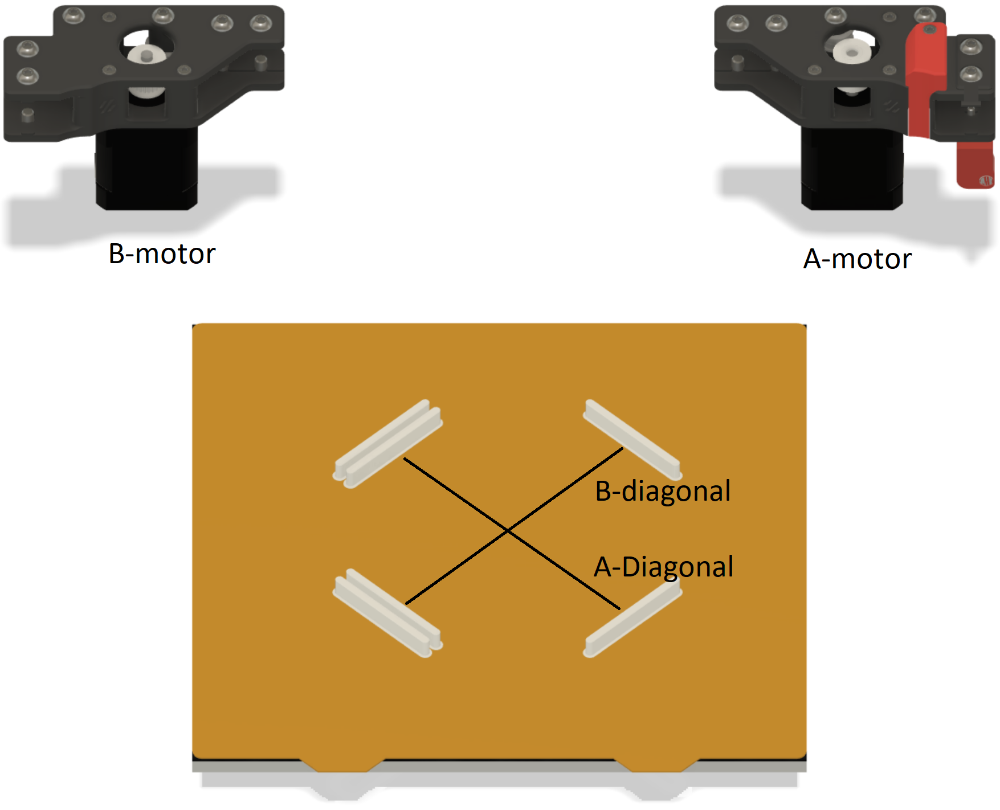
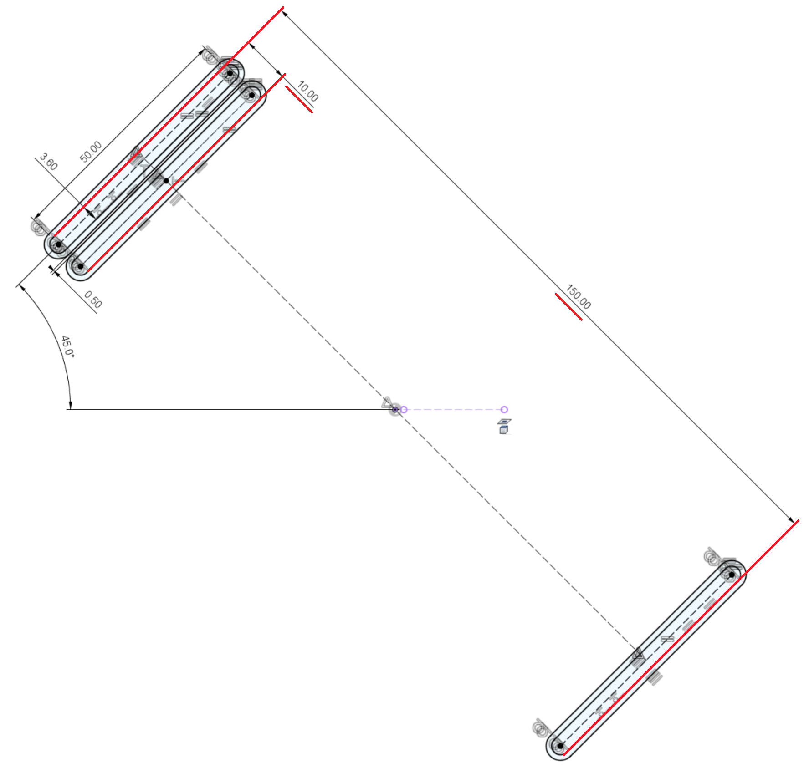
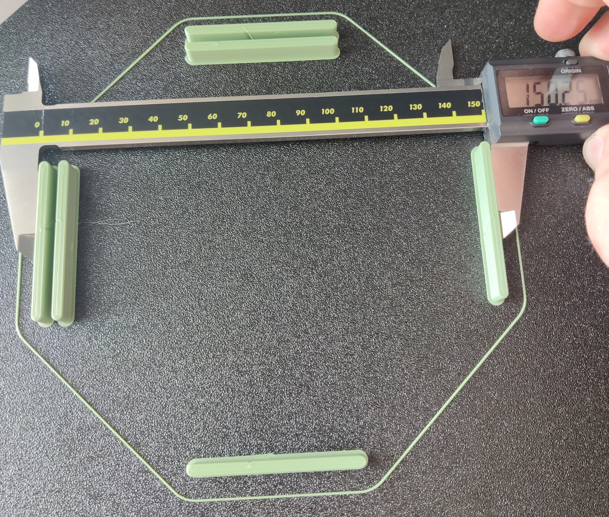
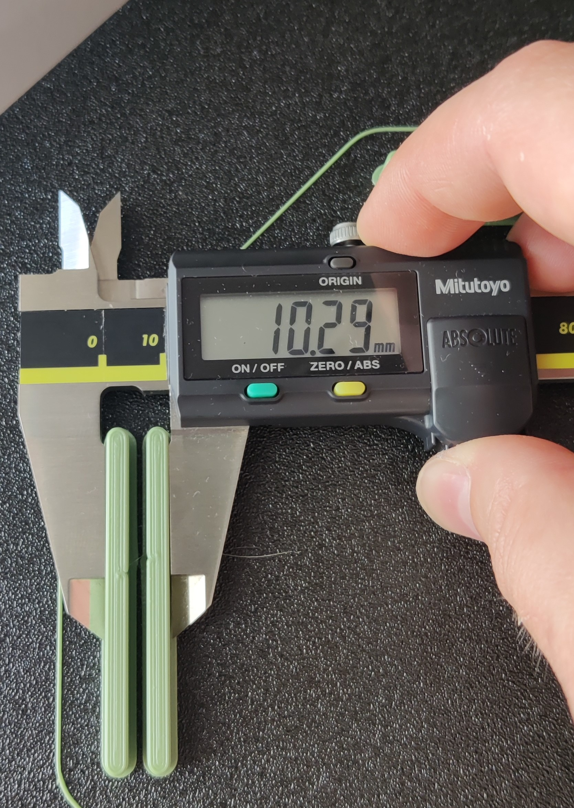

# XY Differential Calibration

## Why is This Calibration Necessary?
Contrary to popular belief, the `rotation_distance` for the A- and B-motors on Core XY printers is not an exact value calculated from the belt pitch and pulley tooth count. The actual value is a function of belt tension and manufacturing tolerances. Therefore it's subject to calibration. If you're not convinced, please see section 8, Appendix in [differential-ab-calibration.pdf](differential-ab-calibration.pdf) for a more thorough explanation.

*"But I can just scale the part in the slicer!"* - If the `rotation_distance` is incorrect, not only is the size of the printed part wrong prior to material shrinkage; The speed that the toolhead moves and accelerates with is also wrong, resulting in the wrong amount of material being extruded per mm, with the extrusion/speed error potentially being different in the A- and B-motor directions. In addition the distance between perimeters will be wrong, further exacerbating the over-/under-extrusion error. Neither of these issues are mitigated by scaling the part in the slicer. Likewise, changing the extrusion multiplier to compensate for the *extrusion errors* introduced by incorrect `rotation_distance` values just moves the over-/under-extrusion to a different feature (e.g. single walls, supports, infill, bridges etc).

It's always better to correct the error directly at the source.

## How is This Different from Other Calibration Procedures?
Other calibration procedures typically fall into two categories:
1. Use a dial gauge indicator to calibrate XYZ movements directly [like Teaching Tech does](https://teachingtechyt.github.io/calibration.html#xyzsteps).
2. Print a part, measure some dimensions and compare them to the intended length and use the resulting scale factor, possibly after averaging like [Calibration Bro](https://www.printables.com/model/164261-calibration-bro-calibration-shape-calculator-klipp) or the non-free [Califlower](https://vector3d.co.uk/product/califlower/) by V3D.

The first category (1) above suffers from difficult setup and a short travel distance on the indicator meaning that any errors from setup or instrument have a proportionally large impact on the final calibration as well as limiting the precision, in particularly on CoreXY printers the setup is bordering on impossible in the presence of even tiny amounts of skew. Previous methods in the second category (2) suffer from issues where the presence of material shrinkage and/or thermal expansion of the print bed are not accounted for, or they calibrate in the XY dimension while the `rotation_distance` values are given for the A/B motors in CoreXY printers, and thus in general this method result in an incorrect calibration for XY steps/rotation distance.

The method proposed here uses the difference between two measurements (therefore it's a "differential measurement") on the same axis to cancel out effects of extrusion width and material shrinkage, it also measures along the A/B axis for CoreXY printers to directly calibrate the `rotation_distance` values, as well as provide steps to mitigate the effects of thermal expansion of the build plate.

**In other words, this method will correctly calibrate the A and B `rotation_distance` even if extrusion multiplier is incorrect, the E-axis `rotation_distance` is also incorrect, and the material shrinks.** Don't believe me? Read the [paper](differential-ab-calibration.pdf). That said low quality filament with inconsistent diameter can affect the results.

## Before We Start
This is a difficult calibration process intended for experts. It requires 1: That you are able to be to measure accurately and consistently and 2: That you follow all the instructions exactly, as they are designed to cancel out various sources of error. If your measurements are not on-point or you don't control the error sources as instructed, you may end up with a worse calibration than your starting point.

Expect to spend an evening/afternoon on this process.

*Note: These instructions apply for CoreXY printers running Klipper. The method itself can be adapted to some cartesian printers and other firmware. But that's out of scope for this document.*

Details about why this works and is correct are explained in [the paper](differential-ab-calibration.pdf). If you intend on adapting this process for other printers than CoreXY printers running Klipper, reading and understanding the paper is highly recommended.

### When Should You Re-Do the Calibration?
Whenever belt tension or frame geometry changes.

### What to Expect in Terms of Results
I reduced the scale error from (0.221%, -0.157%) to (0.007%, 0.007%) for the B- and A-diagonals respectively. The remaining error is from inconsistency in my measurements.

The 150mm reference dimension before calibration measured as 150.24 mm and 149.68 mm on the B- and A-diagonals respectively. This is after material shrinkage so only indicative of the relative difference between A and B. After calibration the same dimensions measured 149.92 mm and 149.93 mm respectively, again, in the presence of material shrinkage.

In terms of skew, before applying this calibration, my skew measurements on XY were: `AB=141.21 CD=140.69 AD=99.72`. After calibration they were: `AB=140.89 CD=140.95 AD=99.64`. The difference between the diagonals on the skew test was reduced from 0.52 mm to 0.06 mm. Skew correction is technically no longer needed for my printer, however I still apply it.

How am I actually sure about these results? Based on measuring the same features repeatedly, I estimate that I can consistently measure the reference dimensions to within 0.01 mm indicated on my digital calipers. The factory calibration certificate states an indicated error of -0.02mm on the 150mm range and 0.00mm on sizes less than 50mm. This yields a total, maximum estimated error (instrument + technique) on the differential measurement of ±0.03 mm, which works out to ±0.0086 in the rotation distance (or about ±8.6 µm per full rotation of the pulley). This is possible thanks a high precision (-0.02mm) error in relation to the long measurement distance (150mm).

### Requirements

For this calibration procedure you will need the following:
* Digital calipers, 150mm long, with a precision of 0.01mm.
  - If you need a recommendation, nobody has ever gotten fired for buying Mitutoyo.
* Some high quality filament with consistent cross-sectional area, ideally 0.02mm deviation or less.
  - If you need a recommendation, Prusament PETG is a good option.
* A Core XY printer running Klipper to calibrate and a free evening.

## Preparation

* On the printer
  * Disable skew correction, if present, it must be redone after this calibration is complete.
    - The presence of the skew correction will prevent the calibration procedure from removing some of the error out of the `rotation_distance` as it is masked by the skew correction.
  * Reset the `rotation_distance` in the `[stepper_x]` and `[stepper_y]` sections to the default, calculated value (40 for most Vorons).
  * If you intend to run input shaper, do it before to improve accuracy of the calibration model part, and again after the calibration to adjust for the scale change in the motor steps.
* In the slicer, slice the [calibration model](stl/AB-Rotation%20Distance%20Calibration%20Model.3mf):
  * Calibrate Pressure Advance for your material of choice, this improves accuracy of the calibration print.
  * Use `External Perimeter First` to make sure the outside perimeters are as consistent as possible.
  * Set extrusion width to 0.5 mm, NO ARACHNE.
     - This works just fine on a 0.4 mm nozzle.
  * Use 5 perimeters to make the model solid material to reduce errors from deflection when measuring.
  * Reduce your extrusion multiplier by about 10%.
     - Make sure you're not over extruding anywhere, under extrusion is better.
  * Slow down the print, we want accuracy and consistency. I recommend 60 mm/s and 800 mm/s^2 for X and Y.
     - You're calibrating, not making a vaguely benchy shaped object.
  * Make sure the seams are positioned away from the measurement surfaces.
     - See the picture below: 
  * Disable brim, there's a built in brim which as been carefully designed so that material shrinkage doesn't affect the result.
  * Use the same bed and nozzle temperature for all layers, and use the lowest bed and nozzle temperature you can get away with.
     - We want the minimum amount of thermal expansion both of the build plate and the filament.
  * Disable cooling fan and use a printing enclosure if possible.
     - We want the part to stay warm until the print is over so it shrinks uniformly.

**A note on the print settings:** Contrary to what V3D says in [STOP Printing Calibration Cubes! (youtube)](https://www.youtube.com/watch?v=dbWAhb40kG4&t=445s) you must make the above changes to your print settings to get an accurate calibration. Remember, we're calibrating the physical movement of the toolhead, not the print itself, therefore we must make sure that the print settings accommodate this as far as possible. Further calibration like for example shrinkage, elephant's foot, extrusion multiplier, etc., needs to be applied after the XY motion has been calibrated to achieve accurate parts.

## Print & Measure

Please read this section completely before starting, I mean it.

1. If you haven't already, create a copy of the [calculation spreadsheet](https://docs.google.com/spreadsheets/d/12_Dv7_rYfVe8zgUhWrPeNcvSJCttsugQXTOSlCp6MAc).
1. Familiarize yourself with the naming convention of the axis to measure along: 
1. Familiarize yourself with the dimensions to be measured in: 
1. The two distances marked with red above should be measured on both the A and B diagonal.
1. Print the G-Code created above.
   - Make sure that both the bed and chamber (if used) remain heated at the same temperature.
1. Let the printed part cool down to the chamber temperature by leaving both the bed and chamber heated for 5 minutes.
1. Measure the indicated reference dimensions in (3), on the A- and B- diagonals **in situ** and enter into the spreadsheet.
   - If you must remove the print bed for measuring, measure quickly and try to keep the bed temperature as best as possible. The calibration will be less accurate.
   - Measure each dimension 3 times, if the measurements aren't consistent (within about 20 µm) you need to improve your technique or control for cooling of the bed or chamber.
1. Take the new values for the `rotation_distance` from the spreadsheet for both the `[x_stepper]` and `[y_stepper]`, and update your Klipper config.
1. Make a note of the measured values for each dimension on each axis, you may need them later.
1. Move the `New Rotations` values into the `Old Rotations` fields in the spreadsheet.
   - Without this, your `rotation_distance` will be wrong in the next iteration.
1. Repeat the calibration process from step 5 until you've reached your desired precision or the `Scale Error` stops shrinking (i.e. you're limited by measurement error).
   - A `Scale Error` of 0.025% correlates to a measurement error of about 20 µm over the 150mm reference dimension. This is a good stopping point if you can achieve it.
   - After reaching your desired stopping point, it's advised to run one more round just to make sure that the previous round wasn't a coincidence.
   - If your `Scale Error` isn't converging towards a low value on both axes, see the [Troubleshooting](#troubleshooting) section.

## After Calibration
Congratulations! Your X and Y axis are now calibrated to a high degree of accuracy.

After completing the XY calibration procedure you need to do some things:
* Re-run input shaper. Because the `rotation_distance` has changed so has the frequency. 
* Re-do skew correction. You might find that it's no longer necessary as your XY axis are now matched to each other. However there's no reason not to do skew correction anyway.
* Consider re-tuning extrusion multiplier on your material profiles.
  - Changes to `rotation_distance` also affects the speed of the toolhead, that changes the rate of extrusion per mm. 
  - The between perimeters might also have changed with the calibration, meaning you may have over-/under-extrusion on perimeters.

## Troubleshooting

If the spreadsheet shows a larger `Scale Error` on both axis on the second calibration round than on the first, that typically indicates that you got the `rotation_distance` for `[x_stepper]` and `[y_stepper]` swapped. You can re-enter the measured values from the first calibration round with the default value for the `Old Rotations` to save yourself one calibration round. Re-print and repeat the process.

Other possible causes for the `Scale Error` being too high is measuring inconsistency (see "Measuring Tips" below), or failure to control all the parameters that affect the surface quality in the "Preparation" section. Please review the slicing parameters, and re-slice as necessary. Make sure you're not missing any steps above.

Sometimes, if the A/B steppers measured notably different values (i.e. there's significant skew), then it might be necessary to re-do the calibration 2-3 times as each run successively removes some skew, which improves your measurements iteratively.

Depending on how large the `Scale Error` is, you may chose settle for a larger value at the cost of lower accuracy.

## Measuring Tips
When measuring, make sure that:

* Both jaws are making parallel contact with the measuring surfaces by applying light pressure on the mid point of the jaws
* Both jaws are making contact on the same height of the printed part, just below the top layer.
* You're not pressing so hard that the part deflects. If you back off on the pressure and the measured value increases slightly, that means that you're pressing too hard as the material flexes back once you release the pressure, or not holding the calipers steady.
* Measure each distance 3-4 times, removing the calipers each time. If you get the same value to within 0.02 mm each time, you'r probably doing it right.

The below pictures show me measuring (one handedly, while holding a camera) the 150 mm and 10 mm reference dimensions respectively:

