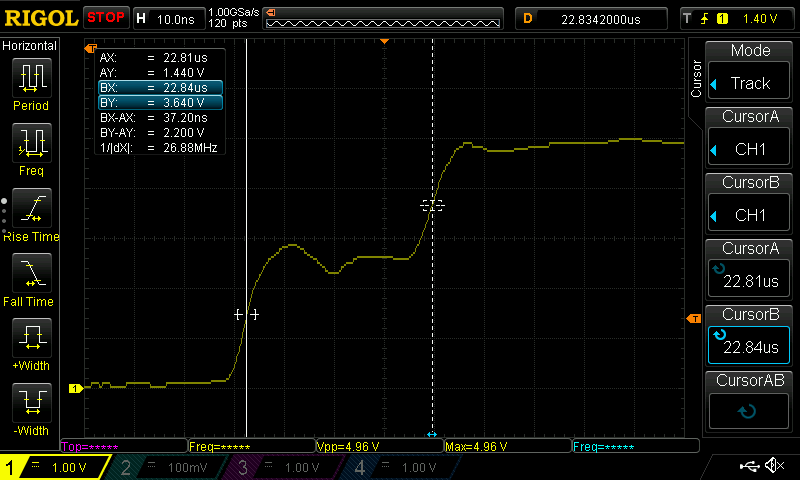
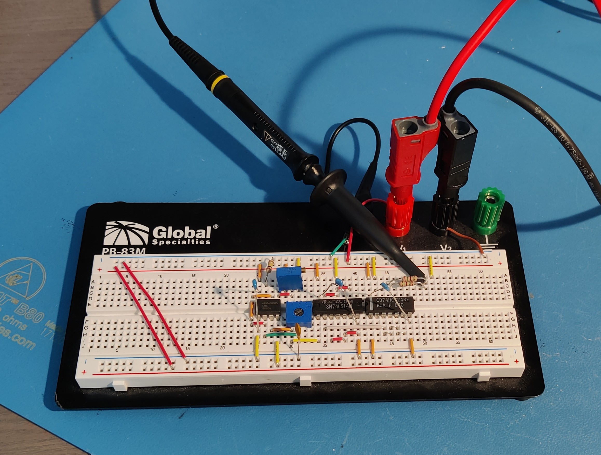
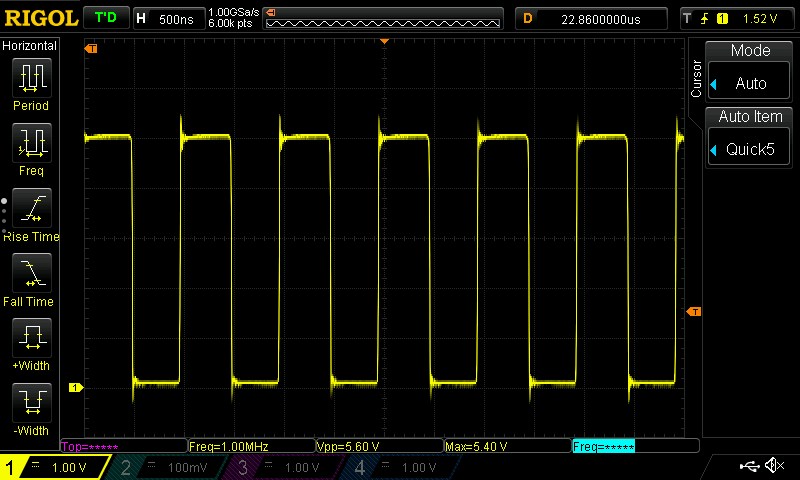
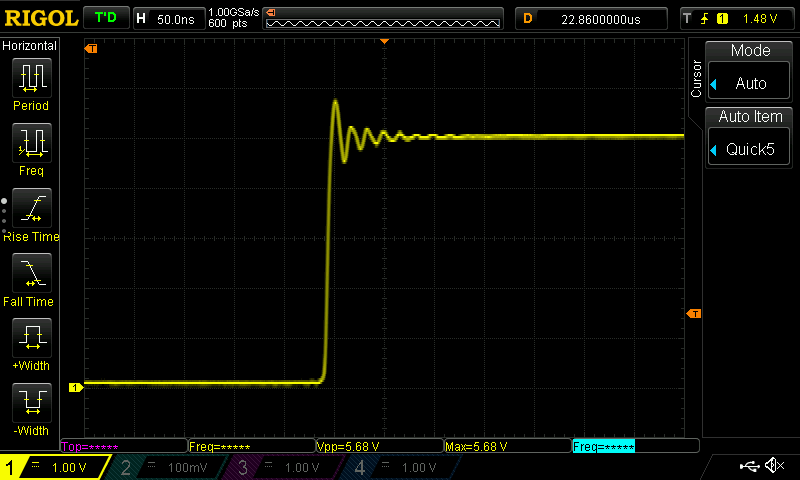
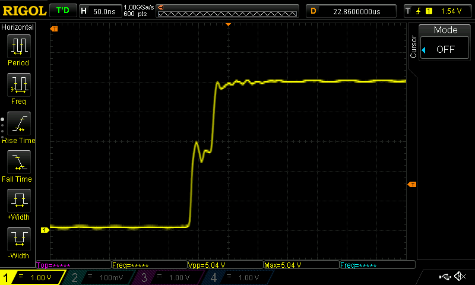
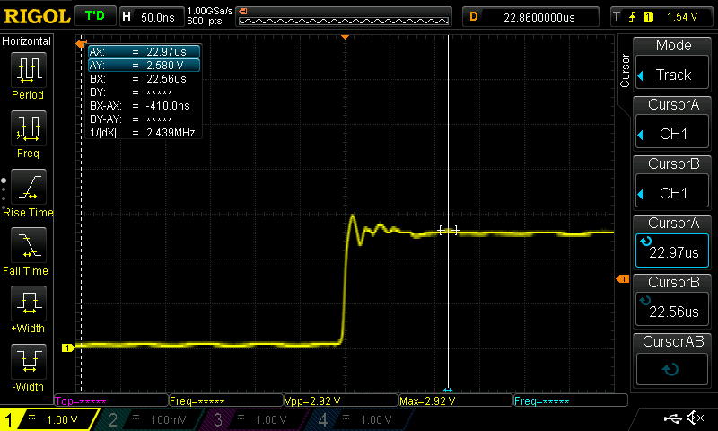
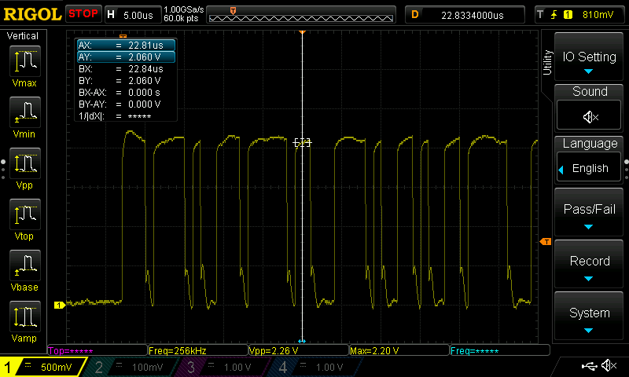

# The igus CF9 cable for CAN bus

Whoa, this page is way too long, I'm not reading all that! 

**TL;DR: It good, use a diagonally opposite pair of conductors for CAN_H/CAN_L.**

## A cable is a cable, why should I care?
When transmitting high frequency signals (around 30 KHz and above) through a cable, we start to run into signal quality issues due to something that's called "impedance mismatch" (among other things). Impedance mismatch causes a fraction of the transmitted signal energy to be reflected back to the sender with a slight delay.

### HOL'UP! What's impedance?!
Impedance ([wikipedia](https://en.wikipedia.org/wiki/Electrical_impedance)) is the opposition to AC current and is a combination of resistance and reactance. Reactance includes things such as back EMF from motor coils and parasitic capacitances etc. 

Although not entirely correct, for the purposes of the below explanation, you can think of it like a resistance to high-frequency signals.

### What do you mean reflected?
Here's an oscilloscope shot of a rising edge of a 5 V, 1 MHz square wave, measured at the source, traveling down a 3 m long cable with a severe impedance mismatch at the end, causing a reflection:

This second edge where the signal rises to 5 V (dashed vertical line) is the reflection of the original signal rising only to 2.5 V (solid vertical line). By reading out the difference in cursor positions (`BX-AX`), we can see that the delay is approximately 37 ns. We can sanity check this by looking up the speed an electrical signal travels in copper wire, which is about `2/3*C ~= 200'000'000m/s` and computing the time the reflection would take to travel down the 3 m cable, and back again: `2*3m / 200'000'000 m/s = 30ns` which is within measurement error of 37 ns for this (admittedly crude) test setup.

### OK so the signal reflects back, why is that bad?
Well, depending on the nature of the impedance mismatch and the length of the cable, this reflection can be either negative or positive (as shown in the oscilloscope shot above) and have varying amounts of delay. If these factors have an unfortunate combination, this can mess with the transmitted signal at the receiver making the transmission break down completely if the mismatch is bad enough, or cause intermittent failures for moderate mismatches.

See for example this oscilloscope shot of a CAN bus transfer in progress on a CAN bus connection made with some random wires and a few different connectors:

Even though it initially looks decent, notice how the top and bottom of the signal isn't flat as expected, this is caused by reflections. In fact this signal is quite poor and at some points the differential signal level drops below the 1.5 V minimum level required by CAN bus, potentially causing transmission errors.

### OK, reflection bad, what do?
As mentioned at the start, the cause of the reflections is impedance mismatch. Signals reflect wherever the impedance that the signal encounters changes.

Our goal is to match impedances wherever possible on the signal path. But what does that mean? We'll we need to pick one impedance that we'll try to get every component of the signal transmission path to match. For CAN this impedance is chosen by the standard to be 120 Ohm. There are 4 major sources of impedance mismatches and we'll adress each in turn:

1. Impedance in the cable.
1. Impedance at the end of the cable.
1. Impedance at connectors, plugs and breaks. 
1. Impedance at the transmitter (more about power transfer than reflections, still important).

### 1. Characteristic impedance of cables
Without going into the details too much, each piece of cable has a characteristic impedance. This is influenced by many things such as thickness of conductors, dielectric constant and thickness of the jacket, wheter it's a twisted pair or not etc.

**OK, so I need to buy a cable with 120 Ohm characteristic impedance for my CAN Bus? Sweet, where buy?**

Not so fast tiger! Let's consider the list of requirements:

* 120 Ohm characteristic impedance.
* Rated for repeated bending at high speeds at bend radii suitable for your printer's umbilical.
* Rated for torsion applications of up to 90° in `sqrt(2)*build_spec_mm` e.g. 0.5 m for a 350mm Trident.
* Rated for the maximum chamber temperature you ever intend to run with some safety margin.
* Has a jacket material that you're able to cut with the tools you have at hand. For example, cutting Polyurethane can be difficult.
* There exists a seller actually willing to sell to you as an individual, you're buying what is typically an industrial use product.
* Conductor configuration: You want 4 wires, 2 for power and ground of suitable thickness for the currents you need, and 2 wires for the CAN_H/L signals that have the controlled impedance. Ideally these are all embedded in one jacket so that you don't need multiple cables in your umbilical, but you can also use two separate cables and wrap them with a cable sheath for example. 

It's also worth noting that properly rated and controlled cable is more expensive than your random ACME Corp wire. You should expect to pay anywhere from 3-10 €/m for such cables. 

Note: I wouldn't recommend going below 0.5 mm^2 (20 AWG) for 4 A. At 24V that's 96 W which should be plenty for most toolheads.

### 2. Impedance at end of the cable
When the signal traveling along the cable reaches the end of the cable, something has to be done to prevent it from reflecting from the "infinite" impedance at the end of the cable (very simplified), this is called "line termination" or just "termination" and you do it by adding a resistor with the same characteristic impedance between the cable and ground (or between the pairs if using differential signalling, such as CAN) as the cable at EACH end of the cable. Because you can get reflections from both ends.

This is why some toolhead boards like the EBB36 have a jumper to select "120 Ohm Termination" on the CAN bus. This should always be enabled unless you're doing something really fancy, but if you're reading this document you're most likely not.

For our use of CAN bus, you should measure 60 Ohm resistance between CAN_H and CAN_L with a multimeter if the termination resistors are set correctly (two 120 Ohm resistors in parallell have a 60 Ohm resistance).

### 3. Impedance at connectors, plugs and breaks
Use only the bare minimum number of plugs and connectors to transmit the signal. Ideally the cable is uninterrupted from the transmitter to the receiver.

### 4. Impedance at the transmitter
This isn't something you typically control as the enduser, but something that the manufacturer of the CAN bus transceiver etc. takes care of, to make sure that the output impedance of the transceiver is matched to the target. Technically a mismatch here doesn't cause reflections, but rather a loss in the transmitted power (and thus signal strength) over the line.

## What's a CF9?
ChainFlex9 (CF9) is a cable type by igus that is also sold to private customers (at least in the EU) and that on paper meets all the requirements above (That's good!), with the notable exception that it doen't have a rated characteristic impedance (That's bad...), at a reasonable price of around 4€/m (That's good!).

Our goal is to determine it's characteristic impedance. If it's close enough to 120 Ohm, it could be an excellent candidate for use as the umbilical for a CAN bus toolhead.

## Experiment set-up 
I built a 1 MHz, 5 Vpp, 50% duty-cycle, 120 Ohm output impedance square wave generator to as closely as possible resemble a CAN bus transmitter operating my target 1 MHz frequency:

On the left, a 555 timer that with the two trim pots is adjusted to provide a (very cruddy, I'm pushing the chip close to its limit) base waveform that has 50% duty cycle and a frequency of 1 MHz.

In the middle, a 74x14 Schottky Inverter recovers the edges of the output from the 555 that is more of a sine wave than a square wave at this point. 

On the right, a 74x243 Bus Transceiver that has enough driving strength to reach the 120R output impedance. On the output is two resistors to adjust the output impedance to be 121 Ohm (as close as I could reasonably get).

Look, I know it looks jank AF, but here's the unloaded output waveform:

and I've measured the output impedance. It's legit. What's that? You want a closeup? Sure thing!

The ringing is from the inductance of the breadboard. It won't affect the experiment.

The Cable Under Test (CUT) attaches to the output of the resistors and there's a signal path to ground next to the resistors for the termination resistance at the end.

By attaching the CUT and attaching a trim potentiometer at the other end of the CUT, the 1 MHz square wave is driven onto the line and the trim pot is adjusted until the reflections disappear. The trim pot is removed and measured to obtain the characteristic impedance of the cable.

## Experiment results
First, to verify the experiment setup we measure the unterminated CF9 cable:

We see the expected reflection with a delay that is cosistent with the cable length. We are observing reflection as expected for this experiment setup and can proceed.

After adjusting the trim potentiometer at the end of the CUT to remove the reflections we measure it to be close enough to 100 Ohm, replace it with a 100 Ohm resistor to verify and measure the following:

This confirms that the cable has a characteristic impedance of approximately 100 Ohm. Typically 120 Ohm cables have a +-10 Ohm tolerance so the CF9 isn't quite as good in terms of characteristic impedance but it might just be good enough (being out 20% from the nominal 120 Ohm), practical tests to follow will evaluate this.

## Practical results
After installing the CF9 as the CAN bus data lines in my system, I again measured it with my oscilloscope.

Here's the result:

We see that the differential output voltage is comfortably around the nominal 2 V for a high signal and below the target 0.5 V for a low signal. At some points it does get close to 0.5 V but it's only briefly. These jaggies around the low transition is most likely caused by the remaining impedance mismatch when transitioning from the wires I used to crimp into the RJ12 connector, to the CF9. I expect that they'll go away if I decide to remove the RJ12 connector in favour of some other, as of yet undecided solution.

## In Summary
The CF9 cable is rated for the motion and environment that the umbilical will be subject to and electrically it's close enough to 120 Ohm impedance that the signal integrity will be good in this application.