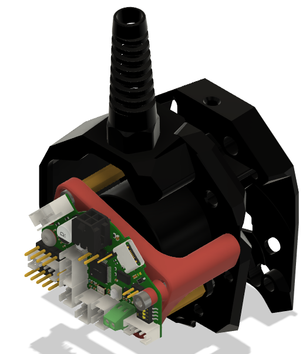

# Boron Umbilical Extruder Mount
A boring umbilical mount for the Stealth Burner/ClockWork 2 on the [Boron Trident](../../README.md).

*This mod is intended to be used with Sensorless Homing on the XY plane and doesn't contain a relocated X-endstop. If you need a X endstop I recommend mounting one on the X-carriage frame so that it bumps up against the right XY Joint.*

 

## Why should I use this over other EBB36 mounts?

I created this mount as I wasn't happy with the existing EBB36 mount mods that I could find for the following reasons: 

* Some didn't have strainrelief for the umbilical, and those that did had a poor implementation. It was attached directly onto the mounting plate that the EBB36 was attached to. This transfers forces and vibrations from the umbilical directly onto the PCB messing with acceleration readings during input shaper calibration.
* All of the mods directly screwed the plastic mounting plate onto the two standoffs. Because the standoffs are long,  the small surface area between the standoffs and the plastic, and the lack of a third fixation point, the EBB36 board can rotate slightly along the axis between the standoffs. Again affecting input shaper calibration.
* The put metal screws direcly against the PCB. There are traces really close to the mounting holes on the PCB and if you're unlucky the screw can scrape off the solder mask and cause a short. 

Therefore I've improved upon these designs in the following ways:
* The Umbilical is attached with proper strain relief to the cable cover, transferring forces from the umbilical to the X-Carriage frame instead of the mounting plate and EBB36.
* The mounting plate is fixed at three points instead of two, and with steel washers to increase the contact area between the plastic and the standoffs. This constrains the mounting plane fully and eliminates the rotation under acceleration.
* It includes plastic washers to prevent metal screw caps from scratching off the soldermask on the PCB and shorting any traces.
* It is designed to as widely as possible reuse hardware from the Trident BOM.

## Printed Parts
Use Voron settings, ABS or PC.

Quantity | Item | Comment
-|-|-
1x | [EBB36 Mounting Plate](STL/%5Ba%5D%20EBB36%20Mounting%20Plate.3mf) | Use the obvious orientation. Accent colour.
2x |  [EBB36 Standoff](STL/%5Ba%5D%20EBB36%20Standoff_x2.3mf) | Accent colour.
1x | [M3 0.4mm Plastic Washer](STL/%5Ba%5D%20M3%200.4mm%20Plastic%20Washer.3mf) | Used for electrical isolation, do not skip. Accent Colour.
1x | [M3 2.6mm Plastic Washer](STL/%5Ba%5D%20M3%202.6mm%20Plastic%20Washer.3mf) | Used for spacing to allow BOM reuse. Accent Colour.
1x | [Replacement Cable Cover](STL/Replacement%20Cable%20Cover.3mf) | Print upside down, theaded M12 hole against printbed.

## Bill Of Materials (BOM)
This mod is designed to use the extras you probably have over from your Trident build where possible, check your spares drawer.

The BOM is for installing on a stock Voron Trident, read the instructions, look at the CAD, make adjustments if needed.

Quantity | Item | Comment 
-|-|-
1x | BTT EBB36 | With included accesories.
1x | M12x1.5 Cable Strain Relief | Make sure threads are M12x1.5, for example `LAPP 53111700`. Will be cut to length.
2x | M3 Washer (DIN125) | Trident BOM. Important for spacing and mounting stability, must be steel.
1x | M3x6 BHCS (ISO 7380-1) | Trident BOM.
2x | M3x8 SHCS (DIN912)  | Trident BOM. 
2x | M3x12 SHCS (DIN912)  | Trident BOM. 
2x | M3x40 SHCS (DIN912)  | Trident BOM. 
1x | M3 Threaded Insert | Trident BOM.
n/a | Printed parts (see above) |

## Pre-Assembly
1. Remove the drag chain mount. Make sure that the M3 heatset insert that it was screwed to is still installed (it's needed but not part of BOM).
1. Remove the CW2 cable cover, keep the M3x6 BHCS and M3x12 SHCS bolts. We'll use then to attach the replacement cover later.
1. Remove any other Toolhead PCB(s) installed.
1. Remove both the screws holding the extruder motor in place. They will be replaced with longer screws.

## Assembly
Instructions are for a stock Voron Trident, make adjustments as needed. Leave the strain relief losely screwed in until you have pulled the umbilical through later.

### Stage 1

1. Reattach the extruder motor.
1. Attach the standoffs to the motor.
1. Install the heatset insert into the mounting plate.
1. Secure the mounting plate onto the two standoffs with the washer as indicated.
1. Reinstall the cable cover using original hardware.

([PDF version](images/Umbilical%20Extruder%20Mount%20-%20Step%201.pdf.pdf))

### Stage 2

1. Using the printed standoffs and washers (pay attention to height difference), secure the EBB36 to the mounting plate.
1. Screw in the strain relief, make a mark where it comes out the other side, take it out, cut it to length and put it back.

([PDF version](images/Umbilical%20Extruder%20Mount%20-%20Step%202.pdf.pdf))
