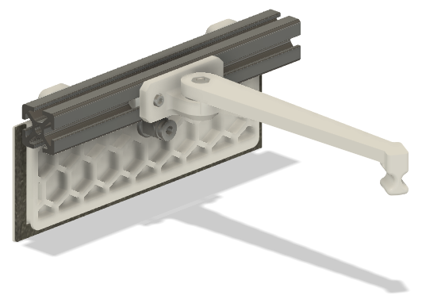
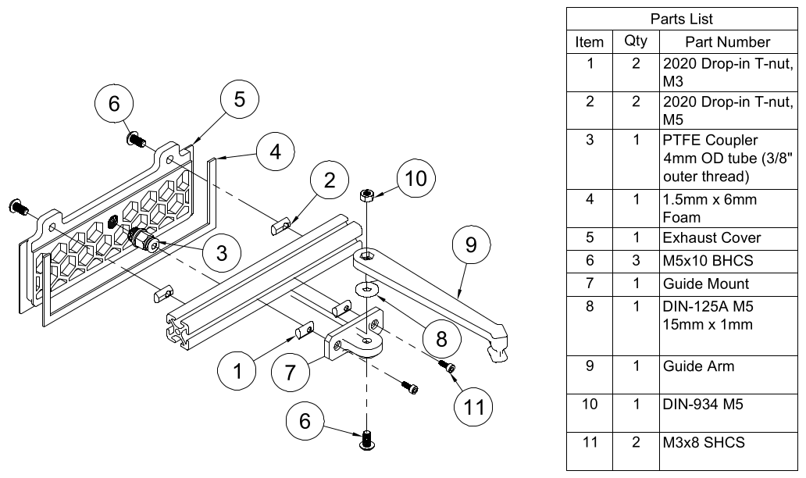

# Boron Umbilical Guide & Exhaust Cover
This mod replaces the back exhaust on the Boron Trident and introduces a guide arm to keep the PTFE bowden tube and umbilical coord from interfering with the X-axis.

Note: The guide head is designed for an umbilical that mounts to the right (A) motor bracket, and is angled to more naturally follow the cable bend. If your umbilical is mounted on the left (B) motor bracket, mirror the arm. If your umbilical is mounted centered, download the CAD file and adjust the angle in Fusion 360.

 

## Printed Parts
Use Voron settings, ABS or PC (Blend).

Quantity | Item | Comment
-|-|-
1x | [[a]_guide_arm.stl](STL/%5Ba%5D_guide_arm.stl) |  Print in obvious orientation.
1x | [[a]_guide_mount.stl](STL/%5Ba%5D_guide_mount.stl) | Print as in picture above, for strength.
1x | [exhaust_cover.stl](STL/exhaust_cover.stl.stl) | Print flat on back, use support for lip. Tree/organic support are easier to remove in this case.

## Bill Of Materials (BOM)
This mod is designed to use the extras you probably have over from your Trident build where possible, check your spares drawer.

The BOM is for installing on a stock Voron Trident, adjustment for your situation.

Quantity | Item | Comment 
-|-|-
2x | 2020 Drop-in T-nut M3 | Trident BOM.
2x | 2020 Drop-in T-nut M5 | Trident BOM.
1x | 2020 Drop-in T-nut M5 | Trident BOM, PTFE Coupler for 4mm OD tube, 3/8" outer thread (often incorrectly sold as "M10").
40 cm | 1.5mm thick x 6mm wide foam | Trident BOM.
3x | M5x10 BHCS (ISO 7380-1) | Trident BOM.
2x | M3x8 SHCS (DIN912)  | Trident BOM. 
1x | M5 15mm OD Washer (DIN125A) | Trident BOM.
1x | M5 Hex Nut (DIN934) | Trident BOM.
1x | 0.1" (3mm) cable tie | For tying down umbilical and bowden tube.
n/a | Printed parts (see above) |

## Pre-Assembly
1. Remove old exhaust if present.

## Assembly
Instructions are for a stock Voron Trident, make adjustments as needed. Use a cable tie to secure the bowden tube and umbilical on either side of the head on the arm.

([PDF version](images/umbilical-guide-assembly.pdf))
