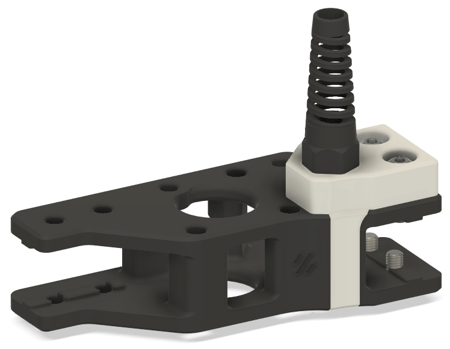
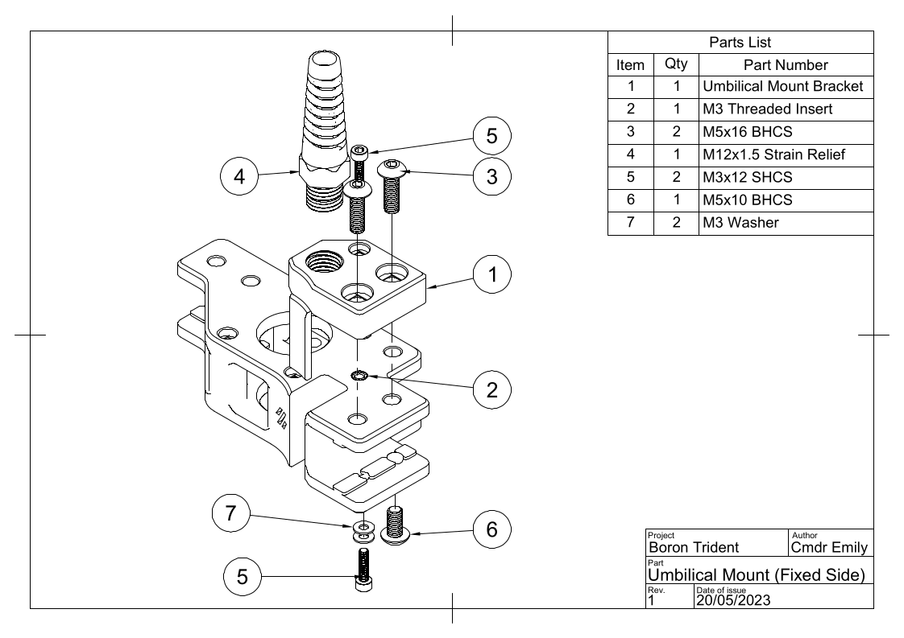

# Boron Umbilical A-Motor Mount
A boring umbilical mount for the A-Motor bracket on the [Boron Trident](../../README.md).

*This mod is intended to be used with Sensorless Homing on the XY plane and doesn't contain a relocated Y-endstop. If you need a Y endstop I recommend mounting one where the "Y Endstop Bumper" used to be so that the XY Joint bumps it.*

 

## Printed Parts
Use Voron settings, ABS or PC.

Quantity | Item | Comment
-|-|-
1x | [[a] Umbilical Mount for A Motor.3mf](STL/%5Ba%5D%20Umbilical%20Mount%20for%20A%20Motor.3mf) | Use the obvious orientation. Accent colour.

## Bill Of Materials (BOM)
This mod is designed to use the extras you probably have over from your Trident build where possible, check your spares drawer.

The BOM is for installing on a stock Voron Trident, read the instructions, look at the CAD, make adjustments if needed.

Quantity | Item | Comment 
-|-|-
2x | M5x16 BHCS (ISO 7380-1) | Trident BOM.
1x | M5x10 BHCS (ISO 7380-1) | Trident BOM.
2x | M3x12 SHCS (DIN912)  | Trident BOM. 
2x | M3 Washer (DIN125) | Trident BOM.
1x | M12x1.5 Cable Strain Relief | Make sure threads are M12x1.5, for example `LAPP 53111700`. Will be cut to length.
n/a | Printed parts (see above) |

## Pre-Assembly
1. Remove tool-head wire harness.
   * If changing to CAN Bus, unplug the entire wire harness and remove from printer. We'll do the wiring [later](../README.md#step-3---install-umbilical-cable).
   * If you're already on CAN Bus, make sure you can get your CAN Bus cable through the mounting hole and strain relief, you may need to re-crimp.
   * If you're keeping the full wire harness with the 20 odd cables. Stop reading and go consider your life choices.
1. Remove X drag chain.
   * Remove the "XY Cable Chain Bridge" and replace the two M5x16 BHCS bolts holding it down with two M5x10 BHCS bolts from the Trident BOM.
   * Remove the mount point for the drag chain on the toolhead.
1. Remove Y drag chain.
   * Remove the "Y Endstop Bumper" from underneath the A-motor mount.
   * Remove the "Wirechain Anchor" from above the A-motor mount.

## Assembly
Instructions are for a stock Voron Trident, make adjustments as needed. Leave the strain relief losely screwed in until you have pulled the umbilical through later.

([PDF version](images/umbilical-motor-mount-assemble.pdf))
